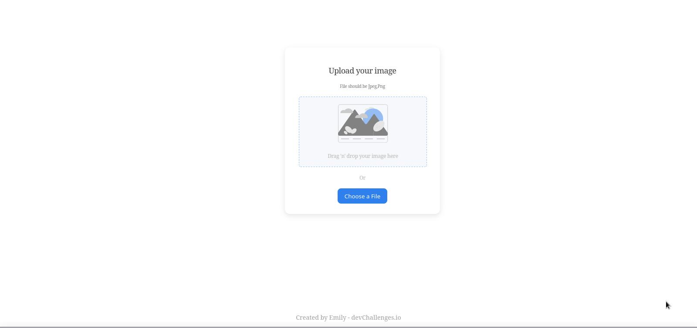

<!-- Please update value in the {}  -->

<h1 align="center">Image Uploader Client Side</h1>

<div align="center">
  <h3>
    <a href="">
      Demo
    </a>
    <span> | </span>
    <a href="https://github.com/Emilio4585/proyectos_portafolio">
      Solution
    </a>
  </h3>
</div>

<!-- TABLE OF CONTENTS -->

## Table of Contents

- [Overview](#overview)
  - [Built With](#built-with)
- [Features](#features)
- [How to use](#how-to-use)
  - [Run it without Docker](#lets-run-it)
  - [Run it With Docker]()
- [Contact](#contact)
- [Acknowledgements](#acknowledgements)

<!-- OVERVIEW -->

## Overview



A website where you can upload a photo and share it with your friends and family.

### Built With

- [React](https://reactjs.org/)


## Features


This site was created as a submission to a [DevChallenges](https://devchallenges.io/challenges) challenge. The [challenge](https://devchallenges.io/challenges/O2iGT9yBd6xZBrOcVirx) was to build an application to complete the given user stories.

## How To Use


To clone and run this site, you'll need [Git](https://git-scm.com) and [Node.js](https://nodejs.org/en/download/) (which comes with [npm](http://npmjs.com)) installed on your computer. From your command line. I will show you two ways to run your project, with and without [Docker](https://www.docker.com/) if you want to use it, makes sure you have it installed and its running.<br><br>


## Lets Run it

Lets see how you can run it without using [Docker](https://www.docker.com/)

```bash
# Clone this repository

$ git clone "repository"

# Go into our client side (ignore if you are already in)
$ cd client

# Install dependencies
$ npm install 
```

Don't forget to create a  *_.env_* file inside *_/src_* folder:

```bash
# Inside .env file

REACT_APP_HOST= YourApiLinkHere
```
Once your dependencies are already installed you can run and see the site

```bash
$ npm start
```

And you can see the site on http://localhost:3000/ 
<br><br>

## Run it with 

The steps are a 'little' differents :), makes sure you have [Docker](https://www.docker.com/) instaled in your system and its running

```bash
#  Lets build de image
$ docker build . -t clientuploader-i

# Ones the images its created you can see it with this command
$ docker images

# And to run it just type....
$ docker run -p 3000:80 -d clientuploader-i 
```

<br>

## DONE

Now you HAVE IT, go to http://localhost:3000 and there you can see your site running :)
<br><br>

### But wait.....

To stop the site just do the following steps...

```bash
# You can stop the container with the name or id, you can see both typing...
$ docker ps

# And stop it >:D
$ docker stop <container name | id>

```

## Acknowledgements

- [Steps to replicate a design with only HTML and CSS](https://devchallenges-blogs.web.app/how-to-replicate-design/)
- [Node.js](https://nodejs.org/)
- [React](https://reactjs.org/)
- [Marked - a markdown parser](https://github.com/chjj/marked)

## Contact

- Website [emily-cruz.ml](http://www.emily-cruz.ml/)
- GitHub [@emily883](https://github.com/emily883)
- Linkedin [Emily Cruz](https://www.linkedin.com/in/emily-fullstack/)